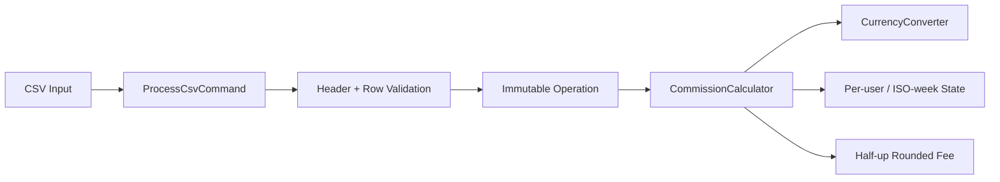

# Commission Calculation Engine

[](https://github.com/DagemawiDeveloper/CommissionApp-Dagemawi/actions/workflows/tests.yml)

A small, framework-independent PHP domain application for calculating deposit and withdrawal commissions across private/business customers and multiple currencies.

The engineering focus is not the CLI itself. It is turning financial policy into validated, deterministic, regression-tested code without silently accepting malformed input.

## What it demonstrates

- PHP 8.1+ domain modeling
- immutable, validated operation objects
- private vs. business fee policies
- weekly withdrawal amount and operation limits
- ISO week-year handling across calendar boundaries
- per-user, per-week state that remains correct for out-of-order rows
- multi-currency normalization relative to EUR
- strict CSV header and row validation
- useful row-number errors for malformed data
- explicit CLI exit behavior
- PSR-4 autoloading with Composer
- PHPUnit unit and CSV-processing tests
- GitHub Actions on PHP 8.1, 8.2, and 8.3

## Business rules represented

| Operation | Customer | Rule in this implementation |
|---|---|---|
| Deposit | Private / Business | 0.03% commission |
| Withdrawal | Business | 0.5% commission |
| Withdrawal | Private | First 3 withdrawals per ISO week can be free, up to a combined €1,000 allowance; 0.3% applies to the commissionable portion |

For private customers:

- each withdrawal consumes one of the three weekly operation slots;
- amounts are normalized to EUR to evaluate the €1,000 allowance;
- if an operation crosses the remaining allowance, only the excess is commissionable while a free operation slot remains;
- after three free operations, later withdrawals in that ISO week are fully commissionable;
- state is isolated by user ID and ISO week-year;
- out-of-order input cannot erase state from a previously processed week.

## Validation boundary

`Operation` rejects invalid data before commission logic runs:

- dates must be real calendar dates in `Y-m-d` format;
- user IDs must be positive integers;
- user type must be `private` or `business`;
- operation type must be `withdraw` or `deposit`;
- amounts must be finite and greater than zero;
- currencies must use a three-letter uppercase-normalized code.

`CurrencyConverter` additionally rejects unsupported currencies, invalid/non-positive rates, duplicate normalized codes, a non-1.0 EUR base rate, and negative conversion amounts.

## Architecture



Responsibilities stay narrow:

- `Operation` validates and normalizes one transaction.
- `CurrencyConverter` validates rates and converts through EUR.
- `CommissionCalculator` applies fee policy and weekly state.
- `ProcessCsvCommand` validates file structure, identifies failing rows, and formats output.
- `script.php` handles CLI arguments and exit codes.

## Installation

```bash
git clone https://github.com/DagemawiDeveloper/CommissionApp-Dagemawi.git
cd CommissionApp-Dagemawi
composer install
```

Generated dependencies are intentionally excluded from source control.

## Run

```bash
php script.php input.csv
```

Success writes one fee per input row. Missing arguments return usage information with exit code `64`; invalid input writes a concise error to STDERR and exits with code `1`.

## Example domain usage

```php
use CommissionApp\Model\Operation;
use CommissionApp\Service\CommissionCalculator;
use CommissionApp\Service\CurrencyConverter;

$calculator = new CommissionCalculator(
    new CurrencyConverter([
        'EUR' => 1,
        'USD' => 1.1497,
        'JPY' => 129.53,
    ])
);

$operation = new Operation(
    '2024-07-01',
    1,
    'private',
    'withdraw',
    1000.00,
    'EUR'
);

$commission = $calculator->calculate($operation); // 0.00
```

## Quality checks

```bash
composer validate --strict --no-check-publish
composer lint
composer test
# or
composer check
```

The suite covers:

- weekly amount and operation allowances;
- partial commission over the free amount;
- weekly reset and user isolation;
- out-of-order rows across multiple weeks;
- ISO week-year boundaries;
- EUR-normalized foreign-currency rules;
- rounding behavior;
- operation/date/type/amount/currency validation;
- exchange-rate validation;
- required CSV headers;
- failing CSV row numbers;
- missing files and formatted output.

## Scope and precision

This reference project uses PHP floating-point arithmetic and explicit half-up rounding to two decimals at the fee boundary. A regulated production ledger should use integer minor units or a decimal-money library, immutable rate snapshots, and persisted calculation/audit records.

## Author

**Dagemawi Alemayehu**  
PHP · Laravel · WordPress · APIs · SaaS Development

[GitHub Profile](https://github.com/DagemawiDeveloper) · [Upwork Profile](https://www.upwork.com/freelancers/dagemawialemayehu)
