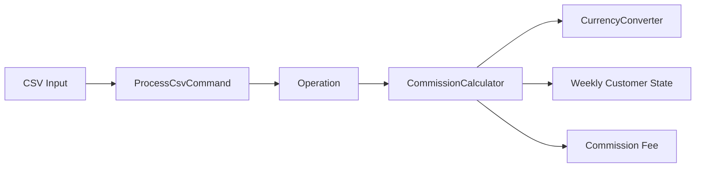

# Commission Calculation Engine

[](https://github.com/DagemawiDeveloper/CommissionApp-Dagemawi/actions/workflows/tests.yml)

A small, testable PHP domain application for calculating deposit and withdrawal commissions across private/business customers and multiple currencies.

This repository demonstrates business-rule implementation, stateful weekly limits, currency normalization, CSV-driven processing, PSR-4 structure and PHPUnit testing without relying on a full web framework.

## What it demonstrates

- object-oriented PHP 8.1+
- domain/business-rule modeling
- private vs. business fee policies
- weekly withdrawal amount + operation limits
- multi-currency normalization
- CSV input processing
- PSR-4 autoloading with Composer
- PHPUnit regression tests
- explicit validation for unsupported/invalid exchange rates
- separation between operations, currency conversion and fee calculation

## Business rules represented

| Operation | Customer | Rule in this implementation |
|---|---|---|
| Deposit | Private / Business | 0.03% commission |
| Withdrawal | Business | 0.5% commission |
| Withdrawal | Private | First 3 withdrawals per calendar week can be free, up to a combined €1,000 allowance; 0.3% applies to the commissionable portion |

For private customers, both limits matter:

- every withdrawal consumes one of the three weekly operation slots;
- amounts are normalized to EUR to evaluate the €1,000 weekly allowance;
- if an operation crosses the remaining amount allowance, only the excess is commissionable while an operation slot is still available;
- once the three free operations are used, later withdrawals in the same week are fully commissionable;
- state resets when a new calendar week begins;
- weekly state is isolated per customer.

## Architecture



The design keeps responsibilities narrow:

- `Operation` represents a transaction.
- `CurrencyConverter` validates rates and handles exchange-rate conversion.
- `CommissionCalculator` applies customer/operation fee policies and weekly state.
- `ProcessCsvCommand` handles input orchestration.

## Project structure

```text
src/
├── Command/
│   └── ProcessCsvCommand.php
├── Model/
│   └── Operation.php
└── Service/
    ├── CommissionCalculator.php
    └── CurrencyConverter.php

tests/
└── CommissionCalculatorTest.php

.github/workflows/tests.yml
composer.json
input.csv
script.php
```

## Installation

```bash
git clone https://github.com/DagemawiDeveloper/CommissionApp-Dagemawi.git
cd CommissionApp-Dagemawi
composer install
```

Requirements:

- PHP 8.1+
- Composer

## Run the application

```bash
php script.php input.csv
```

The input file contains operations that are parsed and passed through the commission engine.

## Run tests

```bash
composer test
```

The regression suite covers:

- private withdrawal inside the weekly amount allowance
- partial commission when an operation crosses the €1,000 allowance
- the fourth withdrawal becoming commissionable even when amount allowance remains
- weekly allowance reset
- per-user state isolation
- business withdrawal commission
- deposit commission
- foreign-currency evaluation against the EUR allowance

## Example domain usage

```php
use CommissionApp\Model\Operation;
use CommissionApp\Service\CommissionCalculator;
use CommissionApp\Service\CurrencyConverter;

$calculator = new CommissionCalculator(
    new CurrencyConverter([
        'EUR' => 1,
        'USD' => 1.1497,
        'JPY' => 129.53,
    ])
);

$operation = new Operation(
    '2024-07-01',
    1,
    'private',
    'withdraw',
    1000.00,
    'EUR'
);

$commission = $calculator->calculate($operation);
```

## Why this is useful as an engineering sample

The interesting part of this project is not the CLI itself—it is translating business policy into predictable, regression-tested code while preserving customer-specific state across operations.

The same engineering pattern appears in larger systems when implementing pricing rules, quotas, credits, usage billing, subscription limits, transaction fees or eligibility logic.

## Quality checks

GitHub Actions runs on PHP 8.1, 8.2 and 8.3 and performs:

- Composer validation
- dependency installation
- PHP syntax checks
- PHPUnit execution

## Author

**Dagemawi Alemayehu**  
PHP · Laravel · WordPress · APIs · SaaS Development

[GitHub Profile](https://github.com/DagemawiDeveloper) · [Upwork Profile](https://www.upwork.com/freelancers/dagemawialemayehu)
