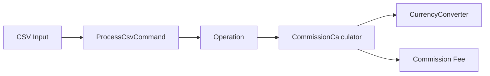

# Commission Calculation Engine

A small, testable PHP domain application for calculating deposit and withdrawal commissions across private/business customers and multiple currencies.

This repository demonstrates business-rule implementation, stateful weekly limits, currency normalization, CSV-driven processing, PSR-4 structure and PHPUnit testing without relying on a full web framework.

## What it demonstrates

- object-oriented PHP
- domain/business-rule modeling
- private vs. business fee policies
- weekly withdrawal allowances
- multi-currency normalization
- CSV input processing
- PSR-4 autoloading with Composer
- PHPUnit tests
- separation between operations, currency conversion and fee calculation

## Business rules represented

| Operation | Customer | Rule in this implementation |
|---|---|---|
| Deposit | Private / Business | 0.03% commission |
| Withdrawal | Business | 0.5% commission |
| Withdrawal | Private | Weekly free allowance, then 0.3% on the commissionable amount |

Private withdrawal calculations track weekly usage per customer. The calculator normalizes non-EUR amounts to EUR when evaluating the free allowance, then converts the commissionable amount back when necessary.

## Architecture



The design keeps responsibilities narrow:

- `Operation` represents a transaction.
- `CurrencyConverter` handles exchange-rate conversion.
- `CommissionCalculator` applies customer/operation fee policies.
- `ProcessCsvCommand` handles input orchestration.

## Project structure

```text
src/
├── Command/
│   └── ProcessCsvCommand.php
├── Model/
│   └── Operation.php
└── Service/
    ├── CommissionCalculator.php
    └── CurrencyConverter.php

tests/
└── CommissionCalculatorTest.php

composer.json
input.csv
script.php
```

## Installation

```bash
git clone https://github.com/DagemawiDeveloper/CommissionApp-Dagemawi.git
cd CommissionApp-Dagemawi
composer install
```

Requirements:

- PHP 8.1+ recommended
- Composer

## Run the application

```bash
php script.php input.csv
```

The input file contains operations that are parsed and passed through the commission engine.

## Run tests

```bash
composer test
```

The test suite currently covers important examples including:

- private withdrawal inside the free allowance
- private withdrawal above the free allowance
- repeated withdrawals in the same week
- weekly allowance reset
- business withdrawal commission
- deposit commission

## Example domain usage

```php
use CommissionApp\Model\Operation;
use CommissionApp\Service\CommissionCalculator;
use CommissionApp\Service\CurrencyConverter;

$rates = [
    'EUR' => 1,
    'USD' => 1.1497,
    'JPY' => 129.53,
];

$calculator = new CommissionCalculator(
    new CurrencyConverter($rates)
);

$operation = new Operation(
    '2024-07-01',
    1,
    'private',
    'withdraw',
    1000.00,
    'EUR'
);

$commission = $calculator->calculate($operation);
```

## Why this is useful as an engineering sample

The interesting part of this project is not the CLI itself—it is translating business policy into predictable code while preserving state across operations such as a customer's weekly withdrawal usage.

That same pattern appears in larger systems when implementing pricing rules, quotas, credits, usage billing, subscription limits, transaction fees or eligibility logic.

## Quality checks

GitHub Actions runs Composer validation, PHP syntax checks and PHPUnit tests on pushes and pull requests.

## Author

**Dagemawi Alemayehu**  
PHP · Laravel · WordPress · APIs · SaaS Development

[GitHub Profile](https://github.com/DagemawiDeveloper) · [Upwork Profile](https://www.upwork.com/freelancers/dagemawialemayehu)
